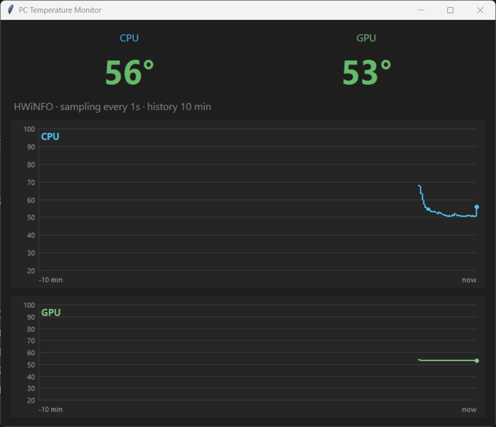

# PC Temperature Monitor

A tiny, lightweight Windows desktop app that shows your **CPU and GPU temperatures in real time**, with rolling history graphs. Built with Python + tkinter and **zero third-party Python packages** — it reads sensor data from [HWiNFO](https://www.hwinfo.com/), which it drives silently in the background.




## Features

- **Live CPU + GPU temperatures** as large, colour-coded readouts (green → amber → red as they heat up).
- **Separate history graphs** for CPU and GPU, stacked vertically, with a rolling 10-minute window.
- **Lightweight** — pure Python standard library, polls once per second on a background thread.
- **Silent** — launches with no console window, runs HWiNFO hidden (off-screen, no flash), and shuts HWiNFO down again when you close the app. Nothing lingers in the background.

## How it works

Reading a modern AMD Ryzen CPU temperature on Windows requires kernel-level hardware access — there's no user-mode API for it. Rather than ship its own driver, this app uses **HWiNFO as a headless sensor engine**:

1. On launch it starts **HWiNFO hidden** (on a separate, non-visible desktop, so its window never appears).
2. It reads the CPU + GPU temperatures from HWiNFO's **shared-memory interface** (pure `ctypes`, no extra libraries).
3. When you close the monitor, it **terminates HWiNFO**.

So HWiNFO runs only while the monitor is open, and you never see it.

## Requirements

- **Windows 10/11** (x64)
- **Python 3.x** (3.13 recommended) — only the standard library is used
- **Administrator rights**: HWiNFO needs admin to read hardware sensors, so the app self-elevates on launch (one UAC prompt)
- Works out of the box on an **AMD Ryzen CPU + NVIDIA GPU**. Other hardware may need a one-line tweak — see [Adapting to other hardware](#adapting-to-other-hardware).

## Installation

```powershell
git clone https://github.com/voltuz/pc_temp.git
cd pc_temp
.\setup.ps1
```

`setup.ps1` creates a local `.venv`, downloads **HWiNFO portable** into `tools\hwinfo\`, and writes its configuration (`HWiNFO64.INI`). HWiNFO is *not* redistributed in this repo — it's downloaded from the official mirror at setup time.

## Usage

```powershell
.\run.bat
```

Accept the **UAC prompt**. The window opens immediately and temperatures appear within ~1.5 s; the graphs fill in over the following minutes. There is no console window, and HWiNFO stays hidden the whole time.

> **Tip:** HWiNFO still shows a system-tray icon while it runs. To hide it permanently: *Settings → Personalization → Taskbar → Other system tray icons → HWiNFO → Off*.

## Configuration

All UI/behaviour knobs are constants at the top of [`app.py`](app.py):

| Setting | Default | Meaning |
|---|---|---|
| `POLL_INTERVAL` | `1.0` | Seconds between samples |
| `HISTORY_SECONDS` | `600` | History window shown on each graph (10 min) |
| `TEMP_MIN` / `TEMP_MAX` | `20` / `100` | Graph Y-axis range (°C) |
| `CPU_THRESH` | `(70, 85)` | CPU amber at 70 °C, red at 85 °C |
| `GPU_THRESH` | `(65, 80)` | GPU amber at 65 °C, red at 80 °C |

HWiNFO startup is tuned for speed in `tools\hwinfo\HWiNFO64.INI`: the slow drive (S.M.A.R.T.) and SMBus/RAM-SPD scans are disabled (`HighestIdeAddress=-1`, `SMBus=0`), cutting cold start from ~5 s to ~1.5 s. CPU/GPU temps are unaffected, since they don't use those buses.

## Adapting to other hardware

Sensor selection lives in [`sensors.py`](sensors.py) (`SharedMemoryReader._parse`) and is intentionally locale-robust (HWiNFO localizes display labels):

- **CPU** — the temperature reading whose label contains the token `Tctl` (AMD Ryzen). For an **Intel** CPU, change this to match `CPU Package`.
- **GPU** — the first temperature on a sensor whose name contains `NVIDIA`/`GEFORCE`, preferring a discrete card over an integrated GPU. For an **AMD/Intel** GPU, adjust the vendor match.

## Project structure

| Path | Purpose |
|---|---|
| `app.py` | tkinter GUI, polling thread, self-elevation, windowless launch |
| `sensors.py` | HWiNFO shared-memory reader + hidden HWiNFO process manager |
| `setup.ps1` | Creates `.venv`, downloads HWiNFO portable, writes its INI |
| `run.bat` | Launcher (runs windowless via `pythonw.exe`) |
| `tools/hwinfo/` | HWiNFO (downloaded) + `HWiNFO64.INI` config |

## Troubleshooting

- **Readouts stuck on "—" / "Waiting for HWiNFO…"** — make sure you accepted the UAC prompt. If HWiNFO's free *Shared Memory Support* was turned off, re-enable it (the app auto-restarts HWiNFO if shared memory goes stale, e.g. the free-version 12-hour limit).
- **CPU shows "—" but GPU works** — your CPU temperature label isn't matched; see [Adapting to other hardware](#adapting-to-other-hardware).
- **HWiNFO download failed during setup** — grab the *Portable* zip from <https://www.hwinfo.com/download/> and copy `HWiNFO64.exe` into `tools\hwinfo\`.
- **Antivirus flags HWiNFO's driver** — HWiNFO loads a kernel driver to read sensors; some AV products flag it as a false positive.

## Credits & notes

- Sensor data is provided by **[HWiNFO](https://www.hwinfo.com/)** by Martin Malik — free for personal use. It is downloaded by `setup.ps1`, not bundled in this repository.
- This project is built for and tested on Windows 11 with a Ryzen 9 9950X + RTX 3090; it should work on most AMD-Ryzen + NVIDIA systems.
